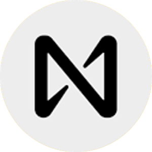

  

## Hi there 👋

I am a blockchain developer with over 8 years of experience with cryptocurrencies and blockchain technology. Are you looking for help with a crypto project? I can help you with:
* Cryptocurrency coin creation (PoW, PoS, PoA, etc)
* Token creation (ERC20, ERC721, ERC721A, ERC404, Solana Token/Token-2022)
* Crypto mining pool creation
* Blockchain explorer creation
* Dapp creation (DEX's, nft marketplaces, staking, etc)
* And more!

**Reach out to me on Telegram to get started! https://t.me/Oxsafe**
 

 

 

<table style="margin-top: 10px;">
  <tr>
    <td align="center" width="70">
      
       Solana
    </td>
    <td align="center" width="70">
      
       Ethereum
    </td>
    <td align="center" width="70">
      
       Polygon
    </td>
    <td align="center" width="70">
      
       Binance
    </td>
    <td align="center" width="70">
      
       Avalanche
    </td>
    <td align="center" width="70">
      
       Bitcoin
    </td>
    <td align="center" width="70">
      
       Cardano
    </td>
    <td align="center" width="70">
      
       Cronos
    </td>
    <td align="center" width="70">
      
       Near
    </td>
    <td align="center" width="70">
      
       cosmos
    </td>
    <td align="center" width="70">
      
       Sui
    </td>
    <td align="center" width="70">
      
       Aptos
    </td>
  </tr>
</table>

### Here are a few examples of the work I have done:

<strong>Tokens</strong>

| Name | Description | Link |
|---------------|-----------------------------------------------------------------|-----------------------------------|
| `RocketETH` | Meme coin on BSC that did 1057x returns. | https://rocketh.netlify.app/ |
| `This Is Fine` | BSC Memecoin based on "This is fine" meme | [Bscscan](https://bscscan.com/token/0x075c4d3cefba974b4fd9cd4217e88c87eb707e80) |
| `MegaX` | Deflationary token on Binance Smart Chain | https://megax.netlify.app/ |
| `UltraX` | Deflationary rewards token on Binance Smart Chain | https://ultrax.netlify.app/ |
| `EtherCake` | Dual rewards token on Binance Smart Chain | https://ethercake.netlify.app/ |
| `Busd Kitty` | Rewards token on Binance Smart Chain | https://busdkitty.netlify.app/ |
| `Dogetopia` | Rewards token on Dogechain | https://dogetopiaworld.netlify.app/ |
| `Make It Out` | Presale token for horror video game | https://makeitout.io/ |
| `R&L Coin` | Rewards token on Binance Smart Chain | https://rl-coin.netlify.app/ |
| `Beliswap` | DEX Governance token on Binance Smart Chain | https://beliswap-website.netlify.app/ |
| `Renewable Energy Mining` | Token for the crypto mining sector | https://rem-ico.com/ |
| `Bitcoin Africa` | Binance smart chain BTC rewards token | [Bscscan](https://bscscan.com/token/0x5406a5Acf6d7330bf780b0Dc7fa2F6ef8E2807ed) |
| `Ethereum Africa` | Binance smart chain ETH rewards token | [Bscscan](https://bscscan.com/token/0x05c9b894B5BA7adb6D95803a3dD886884F298F62) |
| `Baby Omnom` | Rewards token on Dogechain | [Dogescan](https://explorer.dogechain.dog/address/0xeeb141Df490d9CC255DbaB4E233af4aCa9744E23) |
| `True Money Finance` | Titano fork on Binance Smart Chain | https://truemoney.finance/ |
| `Carter Token` | Rewards token on Binance Smart Chain | [Bscscan](https://bscscan.com/token/0x2aA2c24d48670e04a10Db3D3744153fB6f346529) |
| `Defacto` | Token on Ethereum | [Etherscan](https://etherscan.io/token/0x0cb5e8d11e1b57feecf846335d99ed8267e60098) |
| `ARCHETYPALX` | Token on Ethereum | [Etherscan](https://etherscan.io/token/0x9d517e0c9b3579c04fa35ef255bfcffe0f0dd414) |
| `Cramble` | Presale token for online crypto Casino | https://cramble-presale.netlify.app/ |
| `For Humanity` | Presale token on BASE blockchain | [Basescan](https://basescan.org/token/0x1F5CEaB0e64B61B656d45D470085Af13dC15E12d) |
| `CBD Global` | Token for a CBD company | https://cbdglobaltoken.com/ |
| `Sabinbux` | Test token on ETH | [Etherscan](https://etherscan.io/token/0x4fA994e965979De4a26866c3198c3A7b99eCF722) |
| `Genolix` | Token for staking dapp on Polygon | https://geno-staking-dapp.netlify.app/ |
| `` |  |  |

 

<strong>Cryptocurrencies</strong>

| Name | Description | Link |
|---------------|-----------------------------------------------------------------|-----------------------------------|
| `Waglayla` | Custom algo (Walahash) Kaspa fork memecoin | https://waglayla.com/ |
| `Nexis Network` | Lightning fast, scalable, and EVM capable blockchain | https://nexis.network/ |
| `MeowCoin` | Kawpow-based crypto that brings blockchain to the animal sector | https://www.mewccrypto.com/ |
| `Coinsec` | Kaspa fork | https://coinsec.network/ |
| `CmusicAI` | Crypto project that is looking to revolutionize the music industry | https://cmusic.ai/ |
| `XenixChain` | Community-based crypto looking to be the next Bitcoin | https://xenixchain.com/ |
| `RAIA Network` | Crypto project looking to fuel the future of AI | https://www.raianetwork.xyz/ |
| `Bitcoin Luminary` | Bitcoin based crypto with fast transactions | https://bitcoinluminary.com/ |
| `Satoshi Coin` | A more efficient and faster alternative to Bitcoin | https://satoshicoin.network/ |
| `Universal Unit Coin` | Fast and cheap proof-of-work EVM compatible blockchain | https://universalunitcoin.com/ |
| `AgroCoin` | Blockchain technology for the purchase and sale of agroculture commodities | https://www.agrocoin.store/ |
| `Egoncoin` | Fast and cheap ePoS blockchain that is EVM compatible | https://egoncoin.com/ |
| `Wagyucoin` | Competitor to Dogecoin with a love for steak | https://wagyucoin.io/ |
| `Qwertycoin` | Community-based privacy coin | https://qwertycoin.org/ |
| `` |  |  |

 

<strong>Mining Pools</strong>

| Name | Description | Link |
|--------------------|-----------------------------------------------------------------|-----------------------------------|
| `BCH Solo` | BCH solo pool for nerd miners and other mini Bitcoin miners | https://pool.bchsolo.com/ |
| `Eazy Fox` | Mining pool for BCH | https://bch.eazy-fox.io/ |
| `Sedra Pool` | Mining pool for Sedra. (backend) | https://sedrapool.com/ |
| `Bitcoin Luminary` | Mining pool for Bitcoin Luminary. | https://pool.bitcoinluminary.com/ |
| `Hurricane Pool` | Mining pool for Bitcoin and Ethereum Classic | https://hurricanepools.org/ |
| `KaspaMiners` | Mining pool for Kaspa | https://kaspaminers.net/ |
| `HashPool` | Multi-coin pool for BTC, BCH, ETC, and more | https://hashpool.live/ |
| `AsicMinersPool` | Fast and secure multi-coin mining pool based in the US | https://pool.asicminerspool.com/ |
| `Poolbe` | Multi-coin pool for ETC, CLO, OCTA, ETHW, and more  | https://poolbe.eu/ |
| `` |  |  |

 

<strong>Presale Dapps</strong>

| Name | Description | Link |
|---------------|-----------------------------------------------------------------|-----------------------------------|
| `Cramble` | Presale on BSC for Cramble Casino | https://cramble-presale.netlify.app/ |
| `CBD Global` | Presale on BSC for CBD Global | https://cbd-global-presale.netlify.app/ |
| `REM ICO` | Presale on BSC for a renewable energy mining project | https://rem-ico.netlify.app/ |
| `Make It Out` | Presale on BSC for a horror game | https://make-it-out.netlify.app/ |
| `Demo` | Basic Presale Demo on BSC testnet | https://deluxe-stardust-2db635.netlify.app/ |
| `Demo 2` | Basic Presale Demo on BSC testnet | https://finy-ico.netlify.app/ |
| `DCPay` | Presale on ETH for DCPay cryptocurrency project | https://dcpay-presale.netlify.app/ |
| `Storme` | Presale on ETH for Storme cryptocurrency project | https://storme-presale.netlify.app/ |
| `Baby Fine` | Presale on BSC for Baby Fine cryptocurrency project | https://babyfine-presale.netlify.app/ |
| `` |  |  |

 

<strong>Staking Dapps</strong>

| Name | Description | Link |
|---------------|-----------------------------------------------------------------|-----------------------------------|
| `Storme` | Staking dapp on ETH for Storme cryptocurrency project | https://storme-staking.netlify.app/ |
| `MedCareCoin` | Staking dapp on ETH/BSC for MedCareCoin project | https://medcarecoin-staking-eth.netlify.app/ |
| `Genolix DNA Innovation` | Staking dapp on ETH/BSC for Genolix DNA Innovation | https://geno-staking-dapp.netlify.app/ |
| `HOME` | Staking dapp demo for Solana token | https://solana-staking-demo.netlify.app/ |
| `Save Bitcoin` |Staking dapp for Save Bitcoin  | https://save-bitcoin-staking.netlify.app/ |
| `Dexo Staking` | Staking dapp demo for Dexo | https://staking-demo-token.netlify.app/ |
| `` |  |  |

 

<h3 align="left" id="macropower-tech">Tech Stack</h3>

**> Programming languages**

    
    
    
    
    
    

